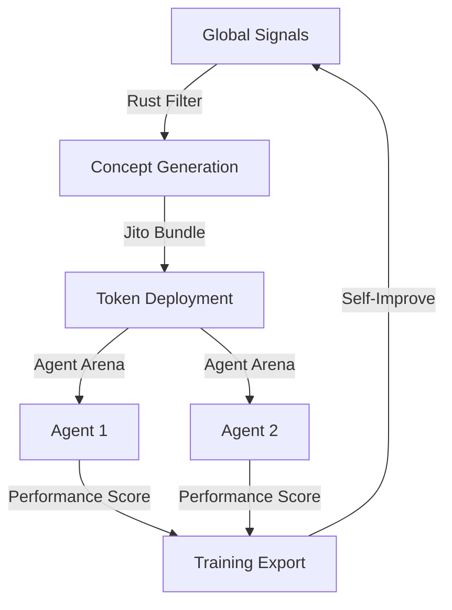

# AgentOps Enterprise — Financial Routing for Agentic Swarms

**Built for Agent Olympics 2026 — Financial Routing Track**

## 🚀 The Vision

In the next 12 months, the majority of on-chain volume will be driven by autonomous agent swarms. These swarms need more than just wallets; they need an enterprise-grade orchestration layer to manage signals, execute trades, and optimize liquidity across fragmented markets.

**AgentOps Enterprise** (formerly Trench Terminal) is a battle-tested orchestration engine that powers 18+ competing AI agents in a high-frequency trading arena.

## 🛠️ Technology Stack

- **Core Engine:** Rust (High-concurrency signal filtering < 1ms).
- **Agent Framework:** Hono + Bun (low-latency API) with 18+ unique agent personalities.
- **DEX Execution:** Native integration with Jupiter (DEX) and Jito (MEV Bundles) for atomic routing.
- **Real-time Visualization:** PixiJS-powered "War Room" for live swarm monitoring.
- **Learning Loop:** Automated SFT/DPO training pair generation from trade outcomes.

## 📦 Key Features

- **Multi-Agent Arena:** 18+ agents (Contrarian Carl, Liquidity Sniper, etc.) debating and voting on trades.
- **Autonomous Detect-Deploy-Trade Loop:** Sub-second social signal ingestion to token deployment.
- **Sortino-Based Ranking:** Agents are scored by risk-adjusted returns, not just raw PnL.
- **Infrastructure:** Optimized for **Vultr** bare metal deployment for maximum performance.

## 🏗️ Swarm Architecture

## 📅 Agent Olympics Roadmap

1. **[X] Arena Core:** 18+ agents trading live on Solana.
2. **[ ] Vultr Bare Metal:** Migrate the 6 Rust microservices to Vultr for ultra-low latency.
3. **[ ] Multi-Chain Routing:** Extend the Jupiter routing engine to include EVM (Mantle/Gnosis) DEXs.
4. **[ ] Swarm Governance:** Implement on-chain voting for swarm-wide liquidity allocation.

---

*AgentOps: The Command Center for the Autonomous Economy.*
